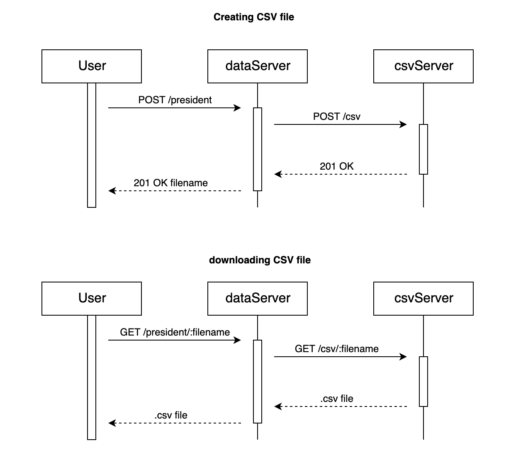

# A Presidential assignment

### Run
- Clone it
- `docker-compose up` (start all servers)

sending post request to http://localhost/president with json file of president list will result in receiving uuid token
```
POST /president HTTP/1.1
Host: localhost
Content-Type: application/json

[
  {
    "id": 15,
    "president": 15,
    "nm": "James Buchanan",
    "pp": "Democrat",
    "tm": "1857-1861"
  },
  {
    "id": 16,
    "president": 16,
    "nm": "Abraham Lincoln",
    "pp": "Republican",
    "tm": "1861-1865"
  }
]
```
sending uuid token as param http://localhost/president/uuid in get request request will trigger downloading .csv file

# Task Requirements

1. Creating two backend services (dataServer and csvServer) 
2. User should be able to send list of presidents to dataServer
3. dataServer should talk to csvServer directly
3. dataServer:
   - exclude presidents from federal list
   - group presidents by century they were selected
   - reverse first name
   - replace party name with acronym
   - order by first name
4. csvServer:
   - generate csv file with adding "Ingestion Time" filed
5. discuss possible solutions for improvements  

sequence diagram: 

# CsvServer

## Running
- Clone it
- `cd csvServer` (enter folder)
- `npm install` (install dependencies)
- `npm run dev` (start server on port 8888)

## Testing
- Clone it
- `cd csvServer` (enter folder)
- `npm install` (install dependencies)
- `npm run test` (runs all 2 tests on port 8000)

# DataServer

## Running
- Clone it
- `cd dataServer` (enter folder)
- `npm install` (install dependencies)
- `npm run dev` (start server on port 80)

## Testing
- Clone it
- `cd dataServer` (enter folder)
- `npm install` (install dependencies)
- `npm run test` (runs all 19 tests on port 8000)

### techonolgy used:
- Node.js
- Koa (my presonal choice over express because it takes advantage of the new async/await keywords )
- Babel (to be able to use latest javascipt syntax)
- joi (for object validation)
- moment (most popular dependency for working with dates in js)
- supertest (for integration test)
- axios (HTTP client of my choice)

### notes
To generate csv file i first look into json2csv dependency. This dependency can parse json to csv but it returns results that take place on Ram memory. For lower ram memory consumption I wanted to stream file directly to disk. Dependency csv-writer did exactly that, but I needed to be able to put timestamp on the row at the moment the row was entered to stream. After short search I decided to write my own function for csv parsing.

### improvements:

- theoretically user could upload very big json file, what will efect time to parse data and can cause 408 request timeout. To prevent this from happening we could decrease request Size Limit or extend request time.
In the case we want to enable big json files to be uploaded and parsed, we should take different approach by creating post request that will also take user email as a param. In that case we could use AWS SNS message que, when dataServer is done with parsing data it will send message to AWS SNS, CSVServer will be automaticaly be triggered to pull that message and it willl generate scv file. Once when the csv is generater CSVServer server can upload file to s3 bucket. From there we could create Lambda function that would send email with link to a file to the user once the file is successfully uploaded to s3 bucker.

- saving data on disk is not the most optimal solution. With this approach we are not able to scale CsvServer. Implementing data storage microservices like for amazon s3 bucket would be ideal solution. Another advantige is that we can use some nice features like expiration time.
